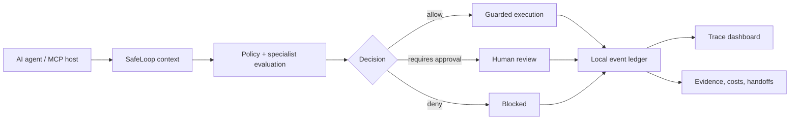

<p align="center">
  
</p>

# SafeLoop

[](https://github.com/czeller81/safeloop/actions/workflows/ci.yml)
[](LICENSE)
[](tsconfig.json)
[](docs/MCP.md)

**Local-first runtime governance and accountability for AI-assisted work.**

SafeLoop puts deterministic identity, authorization, approvals, risk controls, audit trails, evidence, memory checks, and execution boundaries around AI agents.

> Observe -> Decide -> Approve -> Prove
>
> Govern what agents do - and what they learn.

Git tracks code. **SafeLoop tracks and governs agent work.**


## v0.2 — Local Runtime Governance

v0.2 adds a resident local runtime. The decision and the side effect become the
same thing, instead of SafeLoop saying "allowed" and the agent then acting on
its own:

```
Agent → SafeLoop adapter/SDK → SafeLoop runtime → governance decision
      → SafeLoop managed executor → the actual side effect → evidence + ledger
```

```bash
safeloop init --agent coding          # pick a governance profile
safeloop daemon start                 # start the local runtime (127.0.0.1 only)
safeloop run --profile coding -- <your agent>
safeloop status                       # sessions, budgets, breakers, managed paths
safeloop certify                      # 34-check conformance report
```

What that buys you:

- **Bound approvals.** An approval authorizes one exact action, once. It is
  HMAC-signed over the action fingerprint plus the full identity tuple, redeemed
  atomically, and exchanged for an execution permit. There is no "this agent is
  approved" state anywhere.
- **Managed execution.** Shell, filesystem, git, HTTP, and MCP run *inside*
  SafeLoop under a permit. Substituting arguments after approval yields
  `fingerprint_mismatch` and no side effect.
- **Governed memory.** A memory decision binds to the exact candidate, so a safe
  candidate cannot be approved and a poisoned one persisted.
- **Honest path declarations.** Every consequential path is MANAGED, UNMANAGED,
  or DISABLED. An enabled consequential UNMANAGED path *prevents* full-profile
  certification — enforced in code, not in prose.

Language-neutral by contract: the protocol is 26 JSON Schemas
(`protocol/schemas/`), with TypeScript and Python SDKs that share the runtime.
SafeLoop can be implemented in TypeScript; it cannot be dependent on it.

Start here: [`docs/RUNTIME_ARCHITECTURE.md`](docs/RUNTIME_ARCHITECTURE.md) ·
[`docs/APPROVAL_MODEL.md`](docs/APPROVAL_MODEL.md) ·
[`docs/MANAGED_EXECUTION.md`](docs/MANAGED_EXECUTION.md) ·
[`docs/PROFILES.md`](docs/PROFILES.md) ·
[`docs/CONFORMANCE.md`](docs/CONFORMANCE.md) ·
[`docs/ADAPTER_SPEC.md`](docs/ADAPTER_SPEC.md)

## Why It Exists

AI agents can write code, run commands, call tools, hand work to other agents, and produce useful output quickly. The missing layer is often the execution boundary:

- What did the agent try?
- What did SafeLoop decide?
- Was a human needed?
- What evidence proves what happened?
- Did the action stay inside its authority?

SafeLoop is designed for teams and solo builders who want agent speed without giving agents unlimited authority. It is not merely logging: for routed shell/MCP actions, SafeLoop evaluates before execution and blocked or approval-required commands do not reach the shell.

## What SafeLoop Does

| Capability | What it gives you |
|------------|-------------------|
| Command guard | Allow, block, or hold shell commands before execution. |
| Local policy config | `.safeloop/policy.json` for blocked commands, approval triggers, risk limits, and defaults. |
| MCP gateway | `safeloop.checkCommand`, `safeloop.runCommand`, `safeloop.recordActivity`, and `safeloop.status`. |
| MCP stdio server | Local JSON-RPC stdio server for MCP hosts. |
| Specialist governance | Route work, check tool permissions, bind delegated authorizations, and record reviews. |
| Effect guard | Mediate production-impacting effects and report coverage gaps honestly. |
| Runtime policy engine | Normalize consequential actions into allow, warning, approval, pause, deny, or stop decisions. |
| Runtime circuit breaker | Detect repeated tool calls, denied actions, failures, and budget breaches. |
| Hardened approval tokens | HMAC-signed, context-bound, time-limited, single-use approval authorizations. |
| Evidence provenance | Artifact hashing and controlled promotion from observation to verified fact. |
| Memory governance | Verify candidate durable memories before they are written to long-term stores. |
| Scenario loop | Govern multi-step work against a scenario contract. |
| Trace dashboard | Local monitor for agent actions, decisions, approvals, evidence, cost, and timecards. |
| Event ledger | Local JSONL audit trail with malformed-line tolerance. |
| Ledger seal | Sidecar SHA-256 hash-chain seal to detect post-seal ledger edits. |
| Cost accountability | Token/cost/model usage and timecard visibility. |

SafeLoop does not require a hosted service, database, cloud account, or external telemetry pipeline.

Current independent certification: **READY within SafeLoop's documented routed-action boundary** for controlled local pilots where consequential action paths are routed through SafeLoop. See [Production Readiness](docs/PRODUCTION_READINESS.md).

## Five-Minute Start

```bash
npm install
npm test
npm run build
```

Full local verification:

```bash
npm run verify
python -m venv .venv
.venv\Scripts\python.exe -m pip install -r python\requirements-dev.txt
.venv\Scripts\python.exe -m pytest python\tests
```

Initialize local policy:

```bash
npx safeloop init
```

Initialize a school-district offline RAG profile:

```bash
npx safeloop init --profile k12-offline-rag
npx safeloop policy doctor
```

Run local appliance readiness checks:

```bash
npx safeloop appliance doctor --profile k12-offline-rag
```

Export a local audit bundle for review:

```bash
npx safeloop audit export
```

Check a command without executing it:

```bash
npx safeloop check --command "rm -rf ."
```

Run a command through the guard:

```bash
npx safeloop run --command "node -e \"console.log('hello from SafeLoop')\""
```

Seal and verify the local ledger:

```bash
npx safeloop ledger seal
npx safeloop ledger verify
```

Start the local dashboard:

```bash
npm run monitor
# Open http://127.0.0.1:3777
```

## What It Looks Like In Practice

```text
Agent / MCP host
  -> SafeLoop policy + specialist evaluation
  -> allow | requires_approval | deny
  -> guarded execution or held review
  -> local event ledger
  -> trace dashboard + evidence + costs
```



Operating principle: **Maximum useful intelligence inside minimum necessary authority.**

## Honest Security Boundary

SafeLoop is a **cooperative local governance layer**, not an OS sandbox.

SafeLoop can govern actions routed through:

- `createCommandGuard().run()`
- `safeloop check` / `safeloop run`
- MCP gateway or MCP stdio tools
- `createScenarioLoop().step()`
- `guardEffect`
- registered connector/runtime adapters

Blocked and approval-required guarded commands do not reach the shell.

SafeLoop does **not** universally intercept private agent tools, direct shell calls, direct file writes, direct API calls, publishing, messaging, deployments, network requests, or process launches that bypass SafeLoop. For non-cooperative containment, combine SafeLoop with an OS sandbox, container, VM, least-privilege credentials, and network/file-system controls.

See [docs/SECURITY_MODEL.md](docs/SECURITY_MODEL.md).

## Runtime Governance

SafeLoop now exposes a runtime governance API for integrations that need stronger control than passive event recording:

```typescript
import {
  createRuntimeCircuitBreaker,
  evaluateRuntimePolicy,
  verifyCandidateMemory,
} from 'safeloop';
```

Use it when an agent proposes a consequential action, a tool call, or a durable memory write. The API is additive and writes through the same local event ledger, so existing `/api/dashboard` and ledger readers remain compatible.

Reference docs:

- [Runtime governance architecture](docs/RUNTIME_GOVERNANCE_ARCHITECTURE.md)
- [Architecture compliance matrix](docs/ARCHITECTURE_COMPLIANCE_MATRIX.md)
- [Enforcement coverage](docs/ENFORCEMENT_COVERAGE.md)
- [Production readiness](docs/PRODUCTION_READINESS.md)
- [Language-neutral protocol and SDK architecture](docs/LANGUAGE_NEUTRAL_PROTOCOL.md)
- [Runtime event model](docs/EVENT_MODEL.md)
- [Policy engine](docs/POLICY_ENGINE.md)
- [Scenario contracts](docs/SCENARIO_CONTRACTS.md)
- [Human approvals](docs/HUMAN_APPROVALS.md)
- [Evidence and provenance](docs/EVIDENCE_PROVENANCE.md)
- [Circuit breakers](docs/CIRCUIT_BREAKERS.md)
- [Memory governance](docs/MEMORY_GOVERNANCE.md)
- [Threat model](docs/THREAT_MODEL.md)
- [Failure modes](docs/FAILURE_MODES.md)
- [Security dependencies](docs/SECURITY_DEPENDENCIES.md)

## Local Policy

`npx safeloop init` writes:

```text
.safeloop/policy.json
```

With a profile, it also writes:

```text
.safeloop/policy.md
```

`policy.md` is human-readable intent for IT, legal, reviewers, and operators. `policy.json` is the deterministic enforcement file that SafeLoop reads.

The current compiler enforces the Markdown `Blocked` and `Requires Human Review` sections. The `Allowed` section remains human-readable intent unless a future strict allowlist mode is added.

```bash
npx safeloop init --profile k12-offline-rag
npx safeloop policy compile
npx safeloop policy doctor
```

Default policy includes:

- blocked: `rm -rf`, `sudo rm`, `del /s`, recursive `Remove-Item`, `DROP TABLE`
- approval-required: `git push`, `deploy`, `npm publish`
- oversight mode: `HOTL`
- max risk: `high`

If no policy file exists, SafeLoop uses the same conservative defaults.

## Command Guard

```typescript
import { createCommandGuard } from 'safeloop';

const guard = createCommandGuard({
  policy: {
    oversightMode: 'HOTL',
    blockedCommands: ['rm -rf', 'DROP TABLE'],
    requireApprovalFor: ['git push', 'deploy', 'npm publish'],
  },
  agentId: 'my-agent',
  agentName: 'My Agent',
  storageOptions: { baseDir: process.cwd() },
});

const result = guard.run('echo hello');
```

Results include `decision`, `executed`, `stdout`, `stderr`, `exitCode`, `signal`, `cwd`, `durationMs`, `timedOut`, `spawnError`, `failureKind`, and `eventId`.

## MCP Support

SafeLoop includes:

- **MCP command gateway**: programmatic API for command checks, governed command execution, activity recording, and status.
- **MCP stdio server**: JSON-RPC stdio server for MCP hosts.

Run the gateway demo:

```bash
npx ts-node examples/safeloop-mcp-gateway-demo.ts
```

Start the stdio server:

```bash
npx safeloop mcp serve
```

MCP hosts should call `safeloop.checkCommand` or `safeloop.runCommand` instead of raw command tools when SafeLoop governance is required.

Hermes setup helpers:

```bash
npx safeloop mcp doctor --host hermes
npx safeloop mcp print-config hermes
npx safeloop mcp mcporter
```

`mcp doctor` validates initialize, tool discovery, status calls, command denial, local build readiness, and host-specific hints. `mcp print-config hermes` emits a ready-to-paste `mcp_servers` block. `mcp mcporter` prints MCPorter commands for inspecting and calling the SafeLoop MCP server.

See [docs/MCP.md](docs/MCP.md) and [docs/CONNECTORS.md](docs/CONNECTORS.md).

## Specialist Governance

```typescript
import {
  routeSpecialistTask,
  validateSpecialistTool,
  evaluateSpecialistAction,
} from 'safeloop';

const route = routeSpecialistTask({
  objective: 'Run a four-video visual-only MCP pipeline',
});
// route.specialistId === 'video_director'

const toolCheck = validateSpecialistTool('sales', 'terminal');
// toolCheck.allowed === false

const action = evaluateSpecialistAction({
  specialistId: 'sales',
  command: 'npm test',
  environment: 'development',
});
// action.decision === 'DENY'
```

Specialist governance covers deterministic routing, context-aware tool permissions, delegated authorization, review validation, and effect guard coverage.

See [docs/SPECIALIST_GOVERNANCE.md](docs/SPECIALIST_GOVERNANCE.md).

## Local Dashboard

SafeLoop includes a local trace-first monitor:

```bash
npm run monitor
# Open http://127.0.0.1:3777
```

The dashboard focuses on:

- **Trace Console**: what the agent did, what SafeLoop decided, whether human review was needed, and what evidence was created.
- **Decision Inspector**: selected trace details, risk, approval state, evidence, cost/tokens, and redacted raw event JSON.
- **Governance strip**: compact Observe -> Decide -> Approve -> Prove flow.
- **Operational Details**: diagnostics for loops, costs, approvals, evidence, handoffs, readiness, and oversight.

Dashboard endpoints:

- `GET /api/dashboard`
- `GET /api/timecards/export`
- `GET /health`

## School District and Offline RAG Deployments

SafeLoop can support district-controlled local AI appliances where Hermes or another local agent runtime works against internal documents and a local vector database.

For this pattern, SafeLoop should be used to govern agent commands, approvals, evidence, and audit trails. It should be paired with district controls for identity, storage encryption, network isolation, backups, retention, content filtering, incident response, and legal/privacy workflows.

Starter command:

```bash
npx safeloop init --profile k12-offline-rag
npx safeloop appliance doctor --profile k12-offline-rag
npx safeloop audit export
```

See [docs/SCHOOL_DISTRICT_DEPLOYMENT.md](docs/SCHOOL_DISTRICT_DEPLOYMENT.md) and [docs/K12_COMPLIANCE_MATRIX.md](docs/K12_COMPLIANCE_MATRIX.md).

## Codex Demo

SafeLoop is agent-agnostic. Codex is one possible actor that can route local work through SafeLoop.

```bash
npm run demo:codex-governed
```

The demo writes to `.safeloop-codex-demo` and demonstrates:

- allowed local verification
- approval-required publish command
- blocked destructive command
- specialist-denied terminal access
- effect-guard-denied production deploy

It does not call OpenAI APIs and does not claim to intercept private Codex tools automatically.

See [docs/CODEX.md](docs/CODEX.md).

## Claude Integration

SafeLoop can also be used with Claude, Claude Code, or Claude Desktop when those workflows route commands and effects through SafeLoop.

The recommended pattern is to expose SafeLoop through MCP stdio or a local wrapper, then use SafeLoop for command checks, governed execution, explicit audit events, approvals, evidence, and cost records.

SafeLoop does not automatically intercept Claude private tools or direct actions that bypass SafeLoop.

See [docs/CLAUDE.md](docs/CLAUDE.md).

## Event Ledger

SafeLoop writes local events to:

```text
.safeloop/events.jsonl
```

Malformed JSONL lines are skipped during reads; valid events before and after a malformed line are preserved.

Create and verify a sidecar integrity seal:

```bash
npx safeloop ledger seal
npx safeloop ledger verify
```

The seal is stored at `.safeloop/ledger.seal.json`. It does not alter existing event records or change the JSONL event schema.

## Demos

```bash
# Command guard proof
npx ts-node examples/command-guard-demo.ts

# Scenario loop proof
npx ts-node examples/scenario-loop-demo.ts

# Connector status
npx ts-node examples/connector-status-demo.ts

# MCP command gateway demo
npx ts-node examples/safeloop-mcp-gateway-demo.ts

# MCP/Hermes compatibility checks
npx safeloop mcp doctor --host hermes

# Codex-labeled local governance demo
npm run demo:codex-governed

# K-12 local RAG appliance demo
npm run demo:k12-local-rag
```

## Current Verification

Current local verification for this branch:

- `npm run verify`: build, 56 Jest suites / 394 Jest tests, and npm audit
- `.venv\Scripts\python.exe -m pytest python\tests`: 13 Python tests
- `npm run build`
- `npm run build:ui`
- `npx tsc --noEmit`

The exact test count can change as coverage is added.

## Documentation

- [Current State](docs/CURRENT_STATE.md)
- [Architecture](docs/ARCHITECTURE.md)
- [Codex Integration](docs/CODEX.md)
- [Claude Integration](docs/CLAUDE.md)
- [MCP](docs/MCP.md)
- [Security Model](docs/SECURITY_MODEL.md)
- [School District Deployment](docs/SCHOOL_DISTRICT_DEPLOYMENT.md)
- [K-12 Compliance Matrix](docs/K12_COMPLIANCE_MATRIX.md)
- [Connectors](docs/CONNECTORS.md)
- [Specialist Governance](docs/SPECIALIST_GOVERNANCE.md)
- [Roadmap](ROADMAP.md)

## Roadmap

- Approval resume with exact context fingerprint matching
- Stronger connector install/uninstall workflows
- Additional connector guides for more agent runtimes
- Larger-ledger dashboard pagination/windowing
- Optional real-time monitor transport after polling limits become real
- v1.0 release checklist and changelog

## License

MIT
