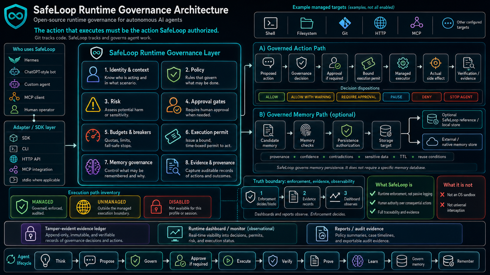

<p align="center">
  
</p>

# SafeLoop

[](https://github.com/czeller81/safeloop/actions/workflows/ci.yml)
[](LICENSE)
[](tsconfig.json)
[](docs/MCP.md)

**Accountability infrastructure for autonomous AI agents.**

Git tracks code. **SafeLoop tracks and governs agent work.**

SafeLoop is a local runtime governance layer for autonomous AI agents. It evaluates and controls agent actions, approvals, memory, budgets, evidence, and configured managed execution paths routed through the SafeLoop runtime.

## Repository Status

The approved public baseline is available from the `stable` branch and the `phase5-approved` tag, both pinned to `0120e92a87b0245faf079391bcddcbf3d6627c81`. That baseline is the last formally approved SafeLoop state before Phase 6 lifecycle-governance review work.

The current Phase 6 review candidate is published separately on `review/phase6` at `e4f8953aad51b2946c4903b06062a562e398973c`. It is intentionally marked **not approved** while MCP descriptor-target classification findings remain under review. Do not treat `review/phase6` or active development commits as the stable release line.

`master` is the development branch. For a reproducible approved checkout, use `stable` or `phase5-approved`. See [docs/INSTALL.md](docs/INSTALL.md) for clone, install, and verification commands.

> Govern what your agents remember, not just what they do.

## Why Runtime Governance Matters

AI agents can write files, run commands, call tools, hand work to other agents, and update durable memory. Logs are useful after the fact, but consequential actions need a decision before the side effect happens.

SafeLoop is built around one invariant:

**The side effect that actually occurs must be the side effect SafeLoop authorized.**

That means the approval, execution permit, managed executor, and evidence record are bound to the security-significant action and context, not to a loose "human clicked approve" state.

## Architecture

Editable v2 source: [docs/architecture/safeloop-runtime-governance-v2.mmd](docs/architecture/safeloop-runtime-governance-v2.mmd)

Rendered v2 diagram:



```text
Agent
  -> SafeLoop adapter / SDK
  -> SafeLoop runtime
  -> governance decision
  -> approval if required
  -> bound execution permit
  -> SafeLoop managed executor
  -> actual side effect
  -> verification / evidence
```

Enforcement is runtime-side. Evidence records what happened. The dashboard observes the runtime ledger; it is not the source of enforcement truth.

```text
Runtime enforcement
  -> Evidence
  -> Dashboard / monitoring
```

## Governed Action Lifecycle

```text
THINK -> PROPOSE -> GOVERN -> APPROVE IF REQUIRED -> EXECUTE
      -> VERIFY -> PROVE -> LEARN -> GOVERN MEMORY -> REMEMBER
```

SafeLoop keeps this ordering conceptually:

```text
deterministic rules
  -> risk evaluation
  -> binding SafeLoop decision
  -> optional LLM analysis
  -> human approval where required
  -> exact managed execution
```

The effective disposition is the stricter result of profile rules and runtime risk evaluation. Approval redemption reconstructs that same effective decision before issuing a permit, so risk-escalated approvals remain redeemable without weakening fail-closed behavior. LLM analysis is not the sole policy enforcer.

## Bound Approval And Execution

Approvals bind to the action and execution context:

```text
Action
  -> canonical representation
  -> fingerprint
  -> identity/context binding
  -> approval
  -> one-time permit
  -> executor re-verification
  -> atomic consumption
  -> exact execution
```

For managed paths, substituting arguments, paths, repositories, branches, or execution context after approval yields a permit or fingerprint mismatch instead of a side effect.

## Governed Memory Lifecycle

SafeLoop governs persistence. It does not have to own the memory database.

```text
Candidate memory
  -> SafeLoop memory governance
  -> verification
  -> disposition
  -> binding persistence authorization
  -> permitted persistence
     -> optional SafeLoop reference/local store
     -> external or native agent memory store
```

Memory dispositions:

- `ALLOW`
- `ALLOW_WITH_TTL`
- `MERGE`
- `QUARANTINE`
- `REQUIRE_REVIEW`
- `REJECT`

Memory checks can include provenance, evidence, confidence, fact-vs-inference classification, contradictions, tenant/scope, sensitive data, TTL or revalidation, reuse conditions, overgeneralization, prompt injection, and memory poisoning.

## Execution Path Inventory

Every consequential path in a governed profile must be declared:

| State | Meaning |
| --- | --- |
| `MANAGED` | Routed through SafeLoop; decision and side effect meet at a managed executor. |
| `UNMANAGED` | Enabled outside SafeLoop's certified boundary, or genuinely non-consequential and documented. |
| `DISABLED` | Not reachable in the profile. |

A fully governed profile requires every enabled consequential path to be `MANAGED` or `DISABLED`. Consequential `UNMANAGED` paths are reported as limitations rather than hidden by wording.

## Six Governance Dispositions

SafeLoop action governance uses six dispositions:

- `ALLOW`
- `ALLOW_WITH_WARNING`
- `REQUIRE_APPROVAL`
- `PAUSE`
- `DENY`
- `STOP_AGENT`

Do not treat `DENY` as a warning or omit it from integration handling.

## Quick Start

```bash
npm ci
npm test -- --runInBand
npm run build
```

Initialize local policy:

```bash
npx safeloop init
npx safeloop daemon start --profile coding
npx safeloop run --profile coding -- <your agent>
npx safeloop status
npx safeloop certify --profile coding
```

Full local verification:

```bash
npm run verify
python -m venv .venv
.venv\Scripts\python.exe -m pip install -r python\requirements-dev.txt
.venv\Scripts\python.exe -m pytest python\tests
npx tsc --noEmit
npm run build:ui
```

## Example Governed Action

```bash
npx safeloop check --command "rm -rf ."
npx safeloop run --command "node -e \"console.log('hello from SafeLoop')\""
npx safeloop ledger seal
npx safeloop ledger verify
```

The command guard and managed executors record decisions, evidence, diagnostics, and ledger events. Approval-required or denied guarded actions do not reach the shell.

## Agent And Framework Integrations

SafeLoop's current reference implementation is TypeScript-based. The runtime protocol is language-neutral, with JSON schemas, TypeScript exports, a Python client, local HTTP APIs, CLI/stdin JSON commands, and MCP surfaces.

Hermes and Malu are integration targets/usages, not partnerships. SafeLoop does not claim to automatically intercept private tools in Codex, Claude Code, Hermes, Malu, Kiro, Replit Agents, or custom runtimes. Those agents must route consequential actions through SafeLoop adapters, SDKs, MCP, HTTP, stdio, CLI, or managed executor paths.

## Filesystem Evidence Semantics

For managed filesystem actions, SafeLoop records observed state truthfully:

- `VERIFIED`: post-state observed and complete SHA-256 computed for files up to and including 64 MiB, or confirmed metadata/absence for metadata/delete cases.
- `PARTIALLY_VERIFIED`: file state observed but content hash skipped because the file exceeded the 64 MiB evidence hash cap.
- `NOT_VERIFIABLE`: path or content could not be observed; unreadable existing paths are not treated as absent.
- `FAILED`: observed post-state contradicts the expected transition.

## Dashboard And Evidence

Start the local monitor:

```bash
npm run monitor
# Open http://127.0.0.1:3777
```

The dashboard surfaces runtime and ledger evidence: decisions, approvals, actions, memory checks, costs, timecards, handoffs, and reports. Enforcement comes from the runtime and managed executors; the dashboard observes and helps operators inspect evidence.

## Security Boundary

SafeLoop is a cooperative local governance layer, not an OS sandbox.

SafeLoop can govern actions routed through:

- `createCommandGuard().run()`
- `safeloop check` / `safeloop run`
- MCP gateway or MCP stdio tools
- `createScenarioLoop().step()`
- `guardEffect`
- registered connector/runtime adapters
- local HTTP, CLI/stdin, or SDK calls that enforce returned decisions
- `verifyCandidateMemory()` before durable memory writes

SafeLoop does **not** universally intercept private agent tools, raw shell calls, direct file writes, direct API calls, publishing, messaging, deployments, network requests, memory writes, or process launches that bypass SafeLoop. It is not kernel containment, EDR, firewalling, universal syscall interception, or arbitrary process sandboxing.

Same-UID local processes, residual userspace filesystem timing gaps, external memory stores, hosted identity, network controls, and non-cooperative containment remain deployment responsibilities. For those, pair SafeLoop with OS permissions, containers, VMs, least-privilege credentials, network policy, and conventional endpoint controls.

## Current Release

GitHub `v0.2.0` is the August 2026 runtime-governance release. The immutable release tag points to commit `01d73bec3500901a1c1e203fb532f0511c9958a4`.

Public npm currently has an older `safeloop@0.7.0` line from June 2026. That line predates the current runtime-governance versioning scheme and has not been rewritten. The next npm publication should use a forward-only synchronization policy that documents the transition explicitly.

## Documentation Index

Start with [docs/README.md](docs/README.md), then:

- [Runtime architecture](docs/RUNTIME_ARCHITECTURE.md)
- [Managed execution](docs/MANAGED_EXECUTION.md)
- [Approval model](docs/APPROVAL_MODEL.md)
- [Memory governance](docs/MEMORY_GOVERNANCE.md)
- [Profiles and conformance](docs/PROFILES.md)
- [Threat model](docs/THREAT_MODEL.md)
- [Security model](docs/SECURITY_MODEL.md)
- [MCP](docs/MCP.md)
- [Connectors](docs/CONNECTORS.md)
- [Codex integration](docs/CODEX.md)
- [Claude integration](docs/CLAUDE.md)

## Contributing

Keep documentation aligned to the implementation boundary: SafeLoop governs configured, routed, managed execution paths. Do not claim universal containment or automatic control over tools that bypass SafeLoop.

## License

MIT