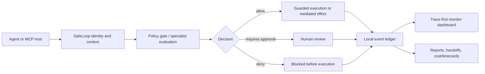

# SafeLoop Architecture

SafeLoop sits between an AI agent and the actions that can change local or external state.




## Core Boundary

SafeLoop is cooperative and local-first. It can govern work only when an agent or tool routes that work through SafeLoop:

- `createCommandGuard().run()`
- `createScenarioLoop().step()`
- MCP gateway tools
- MCP stdio server tools
- `guardEffect`
- connector/runtime adapters that explicitly call SafeLoop
- explicit event recording APIs

SafeLoop does not universally intercept direct shell calls, private tools, direct file edits, direct API calls, publishing, messaging, or deployments that bypass those paths.

## Runtime Governance Layer

The runtime governance layer adds language-neutral policy evaluation around consequential actions:

- canonical JSON Schemas in `schemas/`
- TypeScript SDK exports
- local HTTP endpoints
- CLI/stdin JSON commands
- MCP-compatible command path
- lightweight Python client

The TypeScript engine remains canonical. Non-TypeScript clients should call SafeLoop through HTTP, MCP, or CLI/stdin instead of duplicating policy logic.

For independent certification details, see [Architecture Compliance Matrix](ARCHITECTURE_COMPLIANCE_MATRIX.md) and [Production Readiness](PRODUCTION_READINESS.md).

## Data Flow

1. An agent identifies itself with agent/case/session/task metadata.
2. SafeLoop evaluates the requested action through policy and optional specialist context.
3. SafeLoop returns `allow`, `deny`, or `requires_approval`.
4. Allowed guarded commands execute and capture diagnostics.
5. Denied and approval-required commands do not execute.
6. SafeLoop records explicit local events to `.safeloop/events.jsonl`.
7. The monitor derives UI-ready dashboard data from the same local ledger.

## Storage

SafeLoop uses local file storage. The event ledger is JSONL at:

```text
.safeloop/events.jsonl
```

Reads are tolerant of malformed lines. Valid events before and after a bad line are preserved, and diagnostics identify skipped malformed lines.

SafeLoop can also create a sidecar ledger seal:

```bash
safeloop ledger seal
safeloop ledger verify
```

The seal stores a SHA-256 hash-chain root for valid JSONL event lines. It does not change the event schema.

## Monitor

The local monitor serves the trace-first dashboard at `http://127.0.0.1:3777`.

Key endpoints:

- `GET /api/dashboard`
- `POST /api/governance/evaluate`
- `POST /api/governance/memory`
- `GET /api/timecards/export`
- `GET /health`

`/api/dashboard` remains the compatibility surface for the monitor UI and external local tools.

The governance endpoints are local-first JSON interfaces for non-TypeScript clients. They do not replace MCP stdio or change dashboard compatibility.

## Release Principle

SafeLoop should not claim sandbox-level containment unless an OS/container/platform sandbox is also part of the deployment. The product promise is deterministic local governance for actions routed through SafeLoop.
