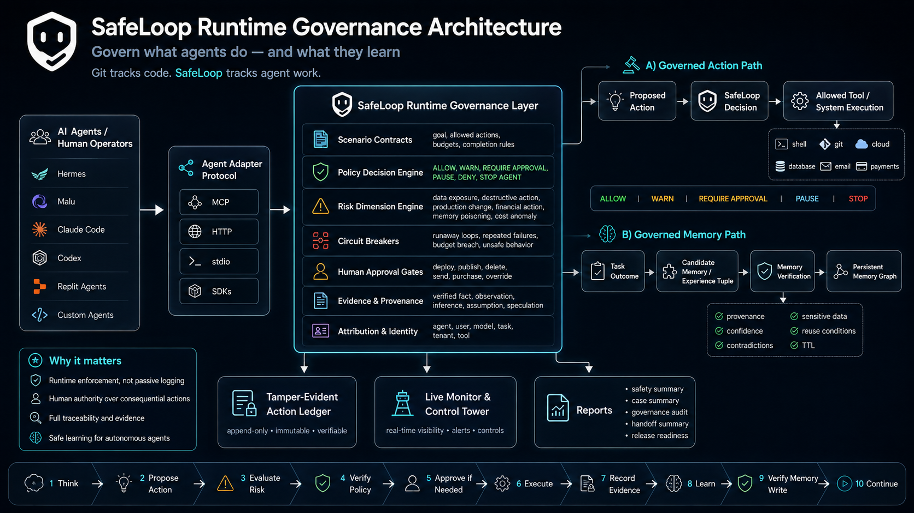

# SafeLoop Architecture

SafeLoop sits between an AI agent and the actions that can change local or external state, when those actions are routed through SafeLoop-managed paths.

Editable v2 diagram source: [architecture/safeloop-runtime-governance-v2.mmd](architecture/safeloop-runtime-governance-v2.mmd)

Historical rendered image:



## Core Boundary

SafeLoop is cooperative and local-first. It can govern work only when an agent or tool routes that work through SafeLoop:

- `createCommandGuard().run()`
- `createScenarioLoop().step()`
- MCP gateway tools
- MCP stdio server tools
- `guardEffect`
- connector/runtime adapters that explicitly call SafeLoop
- local HTTP, CLI/stdin, or SDK calls that enforce returned decisions
- explicit event recording APIs for evidence-only events
- `verifyCandidateMemory()` before durable memory writes

SafeLoop does not universally intercept direct shell calls, private tools, direct file edits, direct API calls, publishing, messaging, deployments, memory writes, or process launches that bypass those paths.

## Core Invariant

**The side effect that actually occurs must be the side effect SafeLoop authorized.**

The governed action path is:

```text
Agent
  -> SafeLoop adapter / SDK
  -> SafeLoop runtime
  -> governance decision
  -> approval if required
  -> bound execution permit
  -> SafeLoop managed executor
  -> actual side effect
  -> verification / evidence
```

Approval is not merely a human click. SafeLoop binds authorization to the action fingerprint, identity, context, one-time permit, executor re-verification, atomic consumption, and exact execution.

## Enforcement Model

SafeLoop preserves this conceptual order:

```text
deterministic rules
  -> risk evaluation
  -> binding SafeLoop decision
  -> optional LLM analysis
  -> human approval where required
  -> exact managed execution
```

LLM analysis can inform review, but it is not the sole policy enforcer.

## Dispositions

Action governance has six dispositions:

- `ALLOW`
- `ALLOW_WITH_WARNING`
- `REQUIRE_APPROVAL`
- `PAUSE`
- `DENY`
- `STOP_AGENT`

`DENY` is a first-class disposition and must not be omitted from diagrams or integration handling.

## Execution Path Inventory

Every consequential path in an integration is declared as one of:

| State | Meaning |
| --- | --- |
| `MANAGED` | Routed through SafeLoop and executed through a managed executor. |
| `UNMANAGED` | Enabled outside the certified SafeLoop boundary, or genuinely non-consequential and documented. |
| `DISABLED` | Not reachable in the profile. |

A fully governed profile requires every enabled consequential path to be `MANAGED` or `DISABLED`.

## Memory Governance

SafeLoop governs memory persistence. It does not need to own the memory database.

```text
Candidate memory
  -> SafeLoop memory governance
  -> verification
  -> disposition
  -> binding persistence authorization
  -> permitted persistence
     -> optional SafeLoop reference/local store
     -> external or native agent memory store
```

Memory dispositions are `ALLOW`, `ALLOW_WITH_TTL`, `MERGE`, `QUARANTINE`, `REQUIRE_REVIEW`, and `REJECT`.

## Dashboard Boundary

Enforcement decides and blocks. Evidence records. The dashboard observes.

```text
Runtime enforcement
  -> Evidence
  -> Dashboard / monitoring
```

The local monitor serves the trace-first dashboard at `http://127.0.0.1:3777`. It surfaces runtime/ledger evidence and compatibility endpoints; it is not an independent enforcement authority.

## Runtime Governance Layer

The runtime governance layer adds language-neutral policy evaluation around consequential actions:

- canonical JSON Schemas in `protocol/schemas/`
- TypeScript SDK exports
- local HTTP endpoints
- CLI/stdin JSON commands
- MCP-compatible command path
- lightweight Python client

SafeLoop's current reference implementation is TypeScript-based. The runtime protocol is language-neutral. Non-TypeScript clients should call SafeLoop through HTTP, MCP, CLI/stdin, or SDK surfaces instead of duplicating policy logic.

For independent certification details, see [Architecture Compliance Matrix](ARCHITECTURE_COMPLIANCE_MATRIX.md) and [Production Readiness](PRODUCTION_READINESS.md).

## Storage

SafeLoop uses local file storage. The event ledger is JSONL at:

```text
.safeloop/events.jsonl
```

Reads are tolerant of malformed lines. Valid events before and after a bad line are preserved, and diagnostics identify skipped malformed lines.

SafeLoop can also create a sidecar ledger seal:

```bash
safeloop ledger seal
safeloop ledger verify
```

The seal stores a SHA-256 hash-chain root for valid JSONL event lines. It makes the ledger tamper-evident after sealing; it does not make local files physically immutable.

## Release Principle

SafeLoop should not claim sandbox-level containment unless an OS/container/platform sandbox is also part of the deployment. The product promise is deterministic local governance for actions routed through SafeLoop.