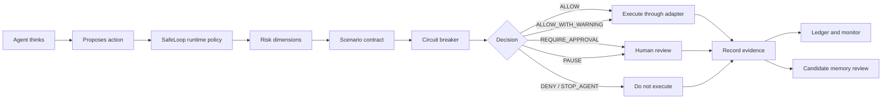

# Runtime Governance Architecture

SafeLoop is moving from passive event logging toward a runtime governance layer for autonomous agents.

> Git tracks code. SafeLoop tracks agent work.

## Architecture Image Review

The diagram in this repository is accurate as a product architecture and target integration model, with these implementation notes:

| Diagram claim | Current repo status | Honest interpretation |
| --- | --- | --- |
| AI agents and human operators connect through adapters, MCP, HTTP, stdio, and SDKs | IMPLEMENTED/PARTIAL | MCP, HTTP, CLI/stdin, TypeScript SDK, and a thin Python client exist. More agent-specific adapters should be added over time. |
| Scenario contracts | PARTIAL | Existing scenario loop contracts govern commands/targets/max attempts. Runtime contracts add broader JSON fields for tools, budgets, evidence, and memory policy. |
| Policy decision engine | IMPLEMENTED | `evaluateRuntimePolicy()` returns allow, warning, approval, pause, deny, or stop decisions. Existing command guard remains the shell enforcement primitive. |
| Risk dimension engine | IMPLEMENTED | Deterministic dimensions exist. Scores are transparent signals, not mathematical safety guarantees. |
| Circuit breakers | IMPLEMENTED/PARTIAL | Runtime circuit breaker covers repeated calls, denied actions, failures, token/cost thresholds, and critical fail-closed risk. Deeper behavioral analytics are future work. |
| Human approval gates | PARTIAL | Guarded approval holds and case approvals exist. Rich approval persistence, signatures, and external identity-provider integration are future work. |
| Evidence and provenance | PARTIAL | Artifacts, attachments, provenance schemas, and verification status fields exist. Full evidence verification workflows are still integration-dependent. |
| Attribution and identity | PARTIAL | Agent/case/session/task metadata exists. Strong identity proof and tenant isolation need deployment controls. |
| Governed action path | IMPLEMENTED WHEN ROUTED | Commands routed through CommandGuard/MCP are blocked or held before execution. Custom tools must call SafeLoop before executing. |
| Governed memory path | IMPLEMENTED AS API | `verifyCandidateMemory()` exists and records decisions. Persistent memory graphs must integrate with it before durable writes. |
| Tamper-evident action ledger | IMPLEMENTED | The ledger is local JSONL with optional hash-chain sealing. It is tamper-evident after sealing, not physically immutable. |
| Live monitor and control tower | PARTIAL | Local monitor shows live traces and operator context. It is not a universal control plane for tools that bypass SafeLoop. |
| Reports | IMPLEMENTED | Safety/case/audit/handoff/readiness-style reporting surfaces exist across the repo. |

Verdict: the repository now supports the architecture when agents and tools route through SafeLoop. It should not be described as universal interception, OS sandboxing, or automatic control over private tools that bypass SafeLoop.

## Current Architecture Map

| Component | Status | Notes |
| --- | --- | --- |
| Command Guard | IMPLEMENTED | `createCommandGuard()` blocks or holds commands before shell execution and records diagnostics. |
| Scenario Loop | PARTIAL | Enforces command/target boundaries and max attempts for routed scenario steps. Needs broader action types over time. |
| MCP Server | IMPLEMENTED | Stdio JSON-RPC server and gateway tools are present. MCP stdio behavior must stay stable. |
| MCP Command Gateway | IMPLEMENTED | `checkCommand`, `runCommand`, `recordActivity`, and `status` route command actions through SafeLoop. |
| Policy Evaluation | PARTIAL | Existing command/file policy gate is deterministic. Runtime path-aware evaluation now lives in `runtimeGovernance`. |
| Scenario Contracts | PARTIAL | Existing contracts cover commands and targets. Runtime contracts add budget, tool, system, evidence, and memory fields. |
| Event Handling | IMPLEMENTED | Local JSONL ledger with malformed-line tolerance. New runtime events are normalized without changing the ledger schema. |
| Agent Attribution | PARTIAL | Adapter/session metadata exists. Runtime events add normalized agent, session, task, tenant, model, and parent fields. |
| Audit Ledger | IMPLEMENTED | Local JSONL plus optional hash-chain seal. |
| Approval Workflow | PARTIAL | Case approvals and command approval holds exist. Expiration and approval stores are still basic. |
| Human Controls | PARTIAL | Approval-required decisions stop guarded execution. Rich operator workflow is dashboard-side and local. |
| Reporting | IMPLEMENTED | Case, handoff, readiness, timecard, and audit export reporting exist. |
| Evidence Handling | PARTIAL | Artifacts and attachments are tracked. Evidence verification classes are defined for runtime use. |
| Cost/Token Accounting | IMPLEMENTED | Model usage, token cost, timecards, and dashboard summaries exist. Runtime policy can evaluate cumulative budgets. |
| Connectors | PARTIAL | Hermes and generic CLI connector foundation exists. More adapters should call runtime governance APIs. |
| Persistence | IMPLEMENTED | Local-first `.safeloop` files. No cloud dependency. |
| Configuration | PARTIAL | Local policy JSON/Markdown profiles exist. Runtime policy config should be integrated incrementally. |
| Tests | IMPLEMENTED | Broad suite exists. Runtime governance tests cover key new behavior. |
| CLI | IMPLEMENTED | Policy, guard, monitor, MCP, audit, appliance, and JSON runtime governance commands exist. |
| APIs | IMPLEMENTED/PARTIAL | `/api/dashboard` remains stable. Local HTTP governance evaluation and memory verification endpoints exist. Broader REST management APIs are future work. |
| Security Boundaries | PARTIAL | Honest cooperative boundary is documented. OS sandboxing is outside SafeLoop itself. |
| Failure Behavior | PARTIAL | Command failures are diagnosed. Runtime policy introduces fail-closed high-risk behavior. |
| Memory Governance | PARTIAL | New framework-neutral candidate memory verification API exists. Adapters still need adoption. |

## Runtime Flow

## Enforcement Boundary

SafeLoop mediates actions routed through:

- `createCommandGuard().run()`
- MCP gateway and MCP stdio tools
- `createScenarioLoop().step()`
- `guardEffect`
- registered adapters and connectors
- `evaluateRuntimePolicy()` when an integration respects the returned decision
- `verifyCandidateMemory()` before durable memory writes

SafeLoop does not universally intercept private tools, raw shell calls, direct file edits, direct API calls, publishing, messaging, deployments, or memory writes that bypass these paths.

## Recommended Migration

1. Keep existing command guard and MCP behavior stable.
2. Add `evaluateRuntimePolicy()` before each consequential adapter/tool action.
3. Add `createRuntimeCircuitBreaker()` per task/session.
4. Add `verifyCandidateMemory()` before any durable memory write.
5. Record runtime decisions into the same local event ledger.
6. Surface runtime events in the monitor without changing `/api/dashboard` compatibility.
