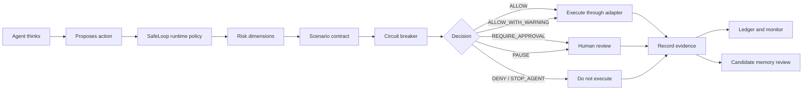

# Runtime Governance Architecture

SafeLoop is a local-first runtime governance layer for autonomous agents when consequential actions are routed through its SDK, MCP, HTTP, stdio, command guard, scenario loop, effect guard, or adapter surfaces.

> Git tracks code. SafeLoop tracks agent work.

## Architecture Image Review

The diagram in this repository is accurate as a product architecture and target integration model, with these implementation notes:

| Diagram claim | Current repo status | Honest interpretation |
| --- | --- | --- |
| AI agents and human operators connect through adapters, MCP, HTTP, stdio, and SDKs | IMPLEMENTED | MCP, HTTP, CLI/stdin, TypeScript SDK, and a thin Python client exist. More agent-specific adapters should be added over time. |
| Scenario contracts | IMPLEMENTED | Scenario loop contracts govern commands, targets, attempts, runtime, cost/tokens, evidence requirements, and memory policy for routed steps. |
| Policy decision engine | IMPLEMENTED | `evaluateRuntimePolicy()` returns allow, warning, approval, pause, deny, or stop decisions. Existing command guard remains the shell enforcement primitive. |
| Risk dimension engine | IMPLEMENTED | Deterministic dimensions exist. Scores are transparent signals, not mathematical safety guarantees. |
| Circuit breakers | IMPLEMENTED | Runtime circuit breaker covers repeated calls, denied actions, failures, token/cost thresholds, and critical fail-closed risk for routed loops and adapters that honor its state. |
| Human approval gates | IMPLEMENTED | Guarded approval holds, case approvals, HMAC-signed context-bound approval tokens, optional local durable replay state, and approval-aware `CommandGuard` redemption exist. External identity-provider integration is future work. |
| Evidence and provenance | IMPLEMENTED | Artifacts, attachments, provenance schemas, evidence verification states, artifact hashing, and local evidence registry support exist. External verifier adapters remain integration work. |
| Attribution and identity | IMPLEMENTED | Agent/case/session/task/tenant metadata is preserved across routed events and approval contexts. Strong enterprise identity proof and tenant isolation need deployment controls. |
| Governed action path | IMPLEMENTED WHEN ROUTED | Commands routed through CommandGuard/MCP are blocked or held before execution. Custom tools must call SafeLoop before executing. |
| Governed memory path | IMPLEMENTED AS API | `verifyCandidateMemory()` exists and records decisions. Persistent memory graphs must integrate with it before durable writes. |
| Tamper-evident action ledger | IMPLEMENTED | The ledger is local JSONL with optional hash-chain sealing. It is tamper-evident after sealing, not physically immutable. |
| Live monitor and control tower | IMPLEMENTED | Local monitor shows live traces, operator context, dashboard compatibility, SSE status, and secured local governance endpoint behavior. It is not a universal control plane for tools that bypass SafeLoop. |
| Reports | IMPLEMENTED | Safety/case/audit/handoff/readiness-style reporting surfaces exist across the repo. |

Verdict: the repository now supports the architecture when agents and tools route through SafeLoop. It should not be described as universal interception, OS sandboxing, or automatic control over private tools that bypass SafeLoop.

## Current Architecture Map

| Component | Status | Notes |
| --- | --- | --- |
| Command Guard | IMPLEMENTED | `createCommandGuard()` blocks or holds commands before shell execution and records diagnostics. |
| Scenario Loop | IMPLEMENTED | Enforces command/target boundaries, max attempts, runtime and cost/token budgets, evidence requirements, memory policy, and circuit breaker decisions for routed scenario steps. |
| MCP Server | IMPLEMENTED | Stdio JSON-RPC server and gateway tools are present. MCP stdio behavior must stay stable. |
| MCP Command Gateway | IMPLEMENTED | `checkCommand`, `runCommand`, `recordActivity`, and `status` route command actions through SafeLoop. |
| Policy Evaluation | IMPLEMENTED | Existing command/file policy gate and runtime path-aware evaluation are deterministic. |
| Scenario Contracts | IMPLEMENTED | Existing contracts cover commands, targets, budgets, evidence, and memory fields for routed scenario work. |
| Event Handling | IMPLEMENTED | Local JSONL ledger with malformed-line tolerance. New runtime events are normalized without changing the ledger schema. |
| Agent Attribution | IMPLEMENTED | Adapter/session metadata exists. Runtime events add normalized agent, session, task, tenant, model, and parent fields. |
| Audit Ledger | IMPLEMENTED | Local JSONL plus optional hash-chain seal. |
| Approval Workflow | IMPLEMENTED | Case approvals, command approval holds, expiring approval tokens, revocation, local durable consumed/revoked token state, and approval-aware command execution exist. |
| Human Controls | IMPLEMENTED | Approval-required decisions stop guarded execution. Rich operator workflow is dashboard-side and local. |
| Reporting | IMPLEMENTED | Case, handoff, readiness, timecard, and audit export reporting exist. |
| Evidence Handling | IMPLEMENTED | Artifacts, attachments, artifact hashes, promotion rules, and local evidence registry support are tracked. |
| Cost/Token Accounting | IMPLEMENTED | Model usage, token cost, timecards, and dashboard summaries exist. Runtime policy can evaluate cumulative budgets. |
| Connectors | PARTIAL | Hermes and generic CLI connector foundation exists. More adapters should call runtime governance APIs. |
| Persistence | IMPLEMENTED | Local-first `.safeloop` files. No cloud dependency. |
| Configuration | PARTIAL | Local policy JSON/Markdown profiles exist. Runtime policy config should be integrated incrementally. |
| Tests | IMPLEMENTED | Broad suite exists. Runtime governance tests cover key new behavior. |
| CLI | IMPLEMENTED | Policy, guard, monitor, MCP, audit, appliance, and JSON runtime governance commands exist. |
| APIs | IMPLEMENTED | `/api/dashboard` remains stable. Local HTTP governance evaluation and memory verification endpoints exist with secured-mode auth, tenant allowlist, rate-limit hook, and payload validation. |
| Security Boundaries | IMPLEMENTED | Honest cooperative boundary is documented. OS sandboxing is outside SafeLoop itself. |
| Failure Behavior | IMPLEMENTED | Command failures are diagnosed. Runtime policy fails closed on high-risk failures and timeouts. |
| Memory Governance | IMPLEMENTED | Framework-neutral candidate memory verification API and reference governed memory adapter exist. External memory frameworks still need adoption. |

## Runtime Flow

## Enforcement Boundary

SafeLoop mediates actions routed through:

- `createCommandGuard().run()`
- MCP gateway and MCP stdio tools
- `createScenarioLoop().step()`
- `guardEffect`
- registered adapters and connectors
- `evaluateRuntimePolicy()` when an integration respects the returned decision
- `verifyCandidateMemory()` before durable memory writes

SafeLoop does not universally intercept private tools, raw shell calls, direct file edits, direct API calls, publishing, messaging, deployments, or memory writes that bypass these paths.

## Recommended Migration

1. Keep existing command guard and MCP behavior stable.
2. Add `evaluateRuntimePolicy()` before each consequential adapter/tool action.
3. Add `createRuntimeCircuitBreaker()` per task/session.
4. Add `verifyCandidateMemory()` before any durable memory write.
5. Record runtime decisions into the same local event ledger.
6. Surface runtime events in the monitor without changing `/api/dashboard` compatibility.
