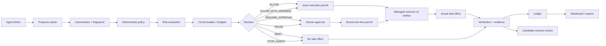

# Runtime Governance Architecture

SafeLoop is a local runtime governance layer for autonomous agents when consequential actions are routed through its SDK, MCP, HTTP, stdio, command guard, scenario loop, effect guard, memory governance API, or adapter surfaces.

> Git tracks code. SafeLoop tracks and governs agent work.

Editable v2 diagram source: [architecture/safeloop-runtime-governance-v2.mmd](architecture/safeloop-runtime-governance-v2.mmd)

Rendered v2 diagram:



## Architecture V2 Summary

```text
Agent
  -> SafeLoop adapter / SDK
  -> SafeLoop runtime
  -> governance decision
  -> approval if required
  -> bound execution permit
  -> SafeLoop managed executor
  -> actual side effect
  -> verification / evidence
```

The core invariant is:

**The side effect that actually occurs must be the side effect SafeLoop authorized.**

The previous rendered architecture image remains useful historical material, but v2 makes these public corrections explicit:

- action execution flows through approval, bound permit, and managed executor before any side effect
- all six action dispositions are represented, including `DENY`
- memory governance is persistence authorization, not a mandatory SafeLoop-owned memory database
- memory can persist to an optional SafeLoop reference store or an external/native memory store after authorization
- execution paths are classified as `MANAGED`, `UNMANAGED`, or `DISABLED`
- dashboard/monitoring observes runtime and ledger evidence; it is not the enforcement authority
- the runtime protocol is language-neutral even though the current reference implementation is TypeScript-based
- the architecture is a routed-action governance boundary, not universal OS/process interception

## Enforcement Ordering

SafeLoop preserves this conceptual order:

```text
deterministic rules
  -> risk evaluation
  -> binding SafeLoop decision
  -> optional LLM analysis
  -> human approval where required
  -> exact managed execution
```

LLM analysis may assist review, but deterministic policy, risk evaluation, binding decisions, and managed executors are the enforcement path.

## Bound Approval / Execution Permit

Approval is not simply "human clicked approve." The security property is:

```text
Action
  -> canonical representation
  -> fingerprint
  -> identity/context binding
  -> approval
  -> one-time permit
  -> executor re-verification
  -> atomic consumption
  -> exact execution
```

Substituting arguments, paths, repositories, branches, tenants, sessions, tasks, or execution context after authorization invalidates the permit or fingerprint check.

## Memory Governance

SafeLoop governs what can be persisted. It does not need to be the durable memory database.

```text
Candidate memory
  -> candidate fingerprint
  -> SafeLoop memory governance
  -> disposition
  -> binding persistence authorization
  -> permitted persistence
     -> optional SafeLoop reference/local store
     -> external or native agent memory store
```

Memory dispositions are `ALLOW`, `ALLOW_WITH_TTL`, `MERGE`, `QUARANTINE`, `REQUIRE_REVIEW`, and `REJECT`.

Memory checks can include provenance, evidence, confidence, fact-vs-inference classification, contradictions, tenant/scope, sensitive data, TTL or revalidation, reuse conditions, overgeneralization, prompt injection, and memory poisoning.

## Execution Path Inventory

Every consequential path in an integration is declared as exactly one of:

| State | Meaning |
| --- | --- |
| `MANAGED` | The path is routed through SafeLoop and executed through a managed executor. |
| `UNMANAGED` | The path is enabled outside SafeLoop's certified boundary, or genuinely non-consequential and documented honestly. |
| `DISABLED` | The path is not reachable in the profile. |

A fully governed profile requires every enabled consequential path to be `MANAGED` or `DISABLED`. Consequential `UNMANAGED` paths are reported as limitations.

## Dashboard / Evidence Boundary

Enforcement decides and blocks. Evidence records. Dashboard observes.

```text
Runtime enforcement
  -> Evidence
  -> Dashboard / monitoring
```

Terms such as control tower, live monitor, or runtime dashboard refer to surfaces over runtime/ledger evidence. They must not be read as independent policy enforcement systems.

## Current Architecture Map

| Component | Status | Notes |
| --- | --- | --- |
| Command Guard | IMPLEMENTED | `createCommandGuard()` blocks or holds commands before shell execution and records diagnostics. |
| Scenario Loop | IMPLEMENTED | Enforces command/target boundaries, max attempts, runtime and cost/token budgets, evidence requirements, memory policy, and circuit breaker decisions for routed scenario steps. |
| MCP Server | IMPLEMENTED | Stdio JSON-RPC server and gateway tools are present. MCP stdio behavior must stay stable. |
| MCP Command Gateway | IMPLEMENTED | `checkCommand`, `runCommand`, `recordActivity`, and `status` route command actions through SafeLoop. |
| Policy Evaluation | IMPLEMENTED | Existing command/file policy gate and runtime path-aware evaluation are deterministic. |
| Scenario Contracts | IMPLEMENTED | Existing contracts cover commands, targets, budgets, evidence, and memory fields for routed scenario work. |
| Event Handling | IMPLEMENTED | Local JSONL ledger with malformed-line tolerance. Runtime events are normalized without changing the ledger schema. |
| Agent Attribution | IMPLEMENTED | Adapter/session metadata exists. Runtime events add normalized agent, session, task, tenant, model, and parent fields. |
| Audit Ledger | IMPLEMENTED | Local JSONL plus optional hash-chain seal. Tamper-evident after sealing, not physically immutable. |
| Approval Workflow | IMPLEMENTED | Case approvals, command approval holds, expiring approval tokens, revocation, local durable consumed/revoked token state, operator credential separation, and approval-aware command execution exist. |
| Human Controls | IMPLEMENTED | Approval-required decisions stop guarded execution. Rich operator workflow is dashboard-side and local. |
| Reporting | IMPLEMENTED | Case, handoff, readiness, timecard, and audit export reporting surfaces exist. |
| Evidence Handling | IMPLEMENTED | Artifacts, attachments, artifact hashes, promotion rules, and local evidence registry support are tracked. |
| Cost/Token Accounting | IMPLEMENTED | Model usage, token cost, timecards, and dashboard summaries exist. Runtime policy can evaluate cumulative budgets. |
| Connectors | PARTIAL | Hermes and generic CLI connector foundation exists. More adapters should call runtime governance APIs. |
| Persistence | IMPLEMENTED | Local-first `.safeloop` files. No cloud dependency. |
| Configuration | PARTIAL | Local policy JSON/Markdown profiles exist. Runtime policy config should be integrated incrementally. |
| Tests | IMPLEMENTED | Broad suite exists. Runtime governance tests cover key behavior. |
| CLI | IMPLEMENTED | Policy, guard, monitor, MCP, audit, appliance, and JSON runtime governance commands exist. |
| APIs | IMPLEMENTED | `/api/dashboard` remains stable. Local HTTP governance evaluation and memory verification endpoints exist with secured-mode auth, tenant allowlist, rate-limit hook, and payload validation. |
| Security Boundaries | IMPLEMENTED | Honest cooperative boundary is documented. OS sandboxing is outside SafeLoop itself. |
| Failure Behavior | IMPLEMENTED | Command failures are diagnosed. Runtime policy fails closed on high-risk failures and timeouts. |
| Memory Governance | IMPLEMENTED | Framework-neutral candidate memory verification API and reference governed memory adapter exist. External memory frameworks must integrate before durable writes. |

## Runtime Flow



## Enforcement Boundary

SafeLoop mediates actions routed through:

- `createCommandGuard().run()`
- MCP gateway and MCP stdio tools
- `createScenarioLoop().step()`
- `guardEffect`
- registered adapters and connectors
- `evaluateRuntimePolicy()` when an integration respects the returned decision
- `verifyCandidateMemory()` before durable memory writes

SafeLoop does not universally intercept private tools, raw shell calls, direct file edits, direct API calls, publishing, messaging, deployments, process launches, network requests, or memory writes that bypass these paths.

## Recommended Migration

1. Inventory all consequential action and memory paths as `MANAGED`, `UNMANAGED`, or `DISABLED`.
2. Disable paths that cannot be governed and are not required.
3. Add `evaluateRuntimePolicy()` before each consequential adapter/tool action.
4. Execute consequential side effects through managed executors where possible.
5. Add `createRuntimeCircuitBreaker()` per task/session.
6. Add `verifyCandidateMemory()` before any durable memory write.
7. Record runtime decisions into the same local event ledger.
8. Surface runtime events in the monitor without changing `/api/dashboard` compatibility.