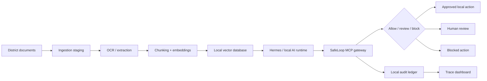

# School District Local RAG Deployment

SafeLoop can be used as a local-first governance layer for school district AI appliances that run Hermes or another local agent runtime against internal documents.

This guide describes a target deployment pattern for an offline or tightly restricted district environment. It is not legal advice and does not make SafeLoop a standalone compliance product.

## Target Pattern



Recommended hardware patterns:

- AI workstation or appliance such as an Asus GX10, Lenovo PGX-class workstation, or equivalent local GPU system.
- Local SSD/NVMe for the operating system, model runtime, SafeLoop, and working indexes.
- NAS or SAN storage for source document archives, larger vector databases, backups, and audit exports.
- No internet access by default, or a strict allowlist when updates are required.

## Data Zones

Keep these zones explicit so the district can assign ownership, retention, and access rules:

| Zone | Purpose | Notes |
|------|---------|-------|
| Ingestion staging | Temporary scanned files and imports | Clear after validation when possible. |
| Extraction/OCR output | Parsed text before chunking | Treat as sensitive student/staff data when source documents are sensitive. |
| Vector database | Embeddings and retrievable chunks | Store locally; encrypt at rest; back up intentionally. |
| SafeLoop ledger | Agent actions, decisions, approvals, evidence, costs | Keep local; seal ledgers after review windows. |
| Evidence artifacts | Generated reports, diffs, exports, proof files | Require approval before external export. |
| Backup set | Recovery media or NAS/SAN snapshots | Test restore; restrict administrator access. |

## Recommended Controls

### Network

- Default to no internet for the AI appliance.
- If updates are required, use a controlled maintenance window and approved update sources.
- Block direct outbound access from agent tools unless the district explicitly allows it.
- Route network, publishing, messaging, and deployment effects through SafeLoop where possible.

### Identity and Access

- Use district-managed administrator accounts.
- Separate operator, reviewer, and system administrator roles.
- Avoid shared admin credentials.
- Keep model/runtime credentials scoped to local services only.

### Storage

- Encrypt local disks and NAS/SAN volumes.
- Keep vector database storage on district-controlled infrastructure.
- Define retention for source scans, OCR text, chunks, embeddings, SafeLoop ledgers, and evidence artifacts.
- Test backup and restore before production use.

### Ingestion

- Document what records are in scope before scanning or importing.
- Minimize unnecessary student personally identifiable information.
- Keep a manifest of imported sources, timestamps, operators, and disposition.
- Require approval for bulk imports, bulk deletes, exports, and removable-media use.

### Runtime Governance

- Configure Hermes or the MCP host to use SafeLoop tools for governed actions.
- Prefer `safeloop.checkCommand` before high-risk work and `safeloop.runCommand` for guarded execution.
- Require human review for document export, network access, publishing, destructive file operations, database resets, and policy changes.
- Seal ledgers after review periods with `safeloop ledger seal`.

### Operations

- Keep offline update packages and checksums where practical.
- Maintain a district change log for model updates, vector index rebuilds, SafeLoop policy changes, and connector changes.
- Exercise incident response for accidental disclosure, bad ingestion, and unauthorized export attempts.
- Review SafeLoop ledgers regularly instead of treating them as passive logs.

## SafeLoop Policy Starting Point

Start with the K-12 profile:

```bash
npx safeloop init --profile k12-offline-rag
npx safeloop policy doctor
npx safeloop appliance doctor --profile k12-offline-rag
```

This writes:

```text
.safeloop/policy.md
.safeloop/policy.json
```

`policy.md` is human-readable district intent. `policy.json` is the deterministic enforcement file used by SafeLoop guards, CLI checks, and MCP commands.

The current compiler enforces the Markdown `Blocked` and `Requires Human Review` sections. The `Allowed` section is kept as readable intent so a broad sentence does not accidentally become a strict command allowlist.

After editing `policy.md`, compile and check it:

```bash
npx safeloop policy compile
npx safeloop policy doctor
```

Run an appliance readiness check before use:

```bash
npx safeloop appliance doctor --profile k12-offline-rag
```

The appliance doctor checks policy readiness, ledger seal status, malformed event diagnostics, optional deployment metadata, K-12 network/export/update approval patterns, and MCP readiness.

Export an audit bundle for district review:

```bash
npx safeloop audit export
```

The audit bundle is local JSON. It includes policy state, policy doctor results, ledger verification, MCP doctor results, event diagnostics, approvals, risks, artifacts, cost/readiness summaries, timecards, and redacted events.

Run the local demo:

```bash
npm run demo:k12-local-rag
```

The demo writes to `.safeloop-k12-demo` and keeps simulation data separate from production ledgers.

The K-12 profile uses `.safeloop/policy.json` to require review for actions that can move or destroy district data:

```json
{
  "oversightMode": "HOTL",
  "blockedCommands": [
    "rm -rf",
    "sudo rm",
    "del /s",
    "Remove-Item -Recurse -Force",
    "DROP TABLE"
  ],
  "requireApprovalFor": [
    "git push",
    "deploy",
    "npm publish",
    "curl",
    "Invoke-WebRequest",
    "scp",
    "rsync",
    "robocopy",
    "format",
    "diskpart",
    "Remove-Item"
  ],
  "maxRisk": "high"
}
```

Adjust this with district IT. For offline appliances, network and removable-media commands usually deserve explicit review.

## Deployment Checklist

- [ ] Appliance has full-disk encryption enabled.
- [ ] Internet access is disabled or restricted by allowlist.
- [ ] Local vector database path is on approved district storage.
- [ ] Source documents, OCR output, chunks, embeddings, logs, and backups have retention rules.
- [ ] Hermes/MCP host is configured to call SafeLoop for governed tools.
- [ ] Raw shell, unmanaged file tools, direct publishing, and direct network tools are removed or restricted when possible.
- [ ] SafeLoop policy is initialized and reviewed by district IT.
- [ ] Human approval is required for exports, deletes, network, removable media, publishing, and production changes.
- [ ] Ledger seal and verification workflow is documented.
- [ ] `safeloop appliance doctor --profile k12-offline-rag` has been reviewed.
- [ ] `safeloop audit export` output location and retention are approved.
- [ ] Backup and restore have been tested.
- [ ] Staff know that SafeLoop is cooperative governance, not a sandbox.

## What SafeLoop Provides

- Local command and effect governance when actions route through SafeLoop.
- MCP stdio tools for local agent hosts.
- Human approval and circuit-breaker decisions.
- Audit event ledger and dashboard visibility.
- Ledger sealing to detect post-seal edits.
- Cost/token/timecard accountability.
- Local K-12 demo and starter templates under `examples/`.

## What Must Be Provided Outside SafeLoop

- OS-level sandboxing, endpoint management, and malware protection.
- Network filtering, CIPA filtering, firewall rules, and egress controls.
- Identity provider, MFA, account lifecycle, and role administration.
- Encryption, key management, backup, retention, and restore operations.
- FERPA/COPPA notices, consent workflows, contracts, and record request procedures.
- Content moderation, data classification, OCR quality review, and RAG answer evaluation.

## References

- FERPA, U.S. Department of Education Student Privacy Policy Office: https://studentprivacy.ed.gov/faq/what-ferpa
- COPPA FAQ, Federal Trade Commission: https://www.ftc.gov/business-guidance/resources/complying-coppa-frequently-asked-questions
- CIPA guidance, USAC E-Rate: https://www.usac.org/e-rate/applicant-process/starting-services/cipa/
- NIST AI Risk Management Framework: https://www.nist.gov/itl/ai-risk-management-framework
- NIST Cybersecurity Framework 2.0: https://www.nist.gov/publications/nist-cybersecurity-framework-csf-20
- CISA K-12 cybersecurity resources: https://www.cisa.gov/stopransomware/k-12-resources
